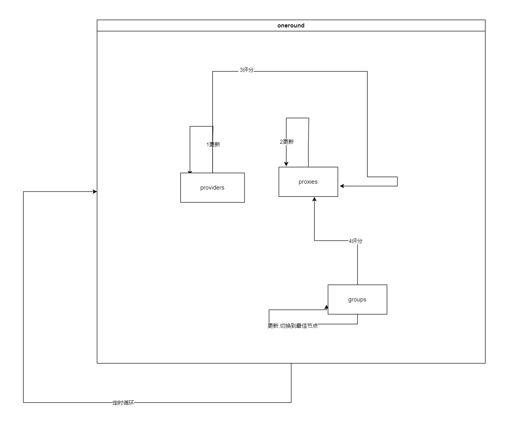

# clash auto-selector plus
### 描述
通过clash-api 实现的节点自动选择器

### 有什么用?
通过评价各个节点,结合组的偏好,切换到最优节点.

### 执行流程

1.provider 更新自己的状态

2.proxies 更新自己的状态

3.provider通过评价体系给proxy评分

4.group 通过评价体系和偏好对proxy评分

5.group选择评价后的最优proxy


#### 评价体系 (目前)
- 延迟(provider侧)
  - 平均延迟
  - 本次延迟
  - 延迟波动
- 解锁(group侧)
  - 各种流媒体

### 配置文件
#### 节点的标签🏷

自行给节点打的标签
组的偏好是相对于标签的
```
proxymark:
    "节点名":
        - 标签
        - ...
    "日本-优化-GPT-0.2x:
        - 日本
        - GPT
        - 低倍率
        
```
#### 组的偏好💓

```
grouplabeldic:
    Final:
        低倍率: 5
        飞舞结点: 0.01
        香港: 2.3
        高倍率: 0.3
    美国:
        Chatgpt: 3
        Spotify: 3
        飞舞结点: 0.01
        高倍率: 0.3
```
上面的规则意思是 
- Final组对有 低倍率和香港 标签的节点更偏好,这些节点有较普通节点高的优先级; 对 飞舞节点和高倍率 排斥,这些节点有较普通节点低的优先级.

- 美国组的两个流媒体标签是特殊的,它们先加成,然后再通过检测解锁状态二次加成.意思就是 更偏好有这些流媒体标签的节点,更更偏好有流媒体标签而且解锁正常的节点.

### 实现
- 透过clash api

### 怎么用?

- 下载released 文件

- 第一次执行,无配置文件,通过终端提示,完善基础信息,会自动生成一个模板 config.yaml
- 有配置文件 可以指定配置文件路径. `dash 路径`

### bugs
- 似乎有goroutine泄露

### 感谢

- [nkeonkeo/MediaUnlockTest](https://github.com/nkeonkeo/MediaUnlockTest)
- [obgnail/clash-api](https://github.com/obgnail/clash-api)
