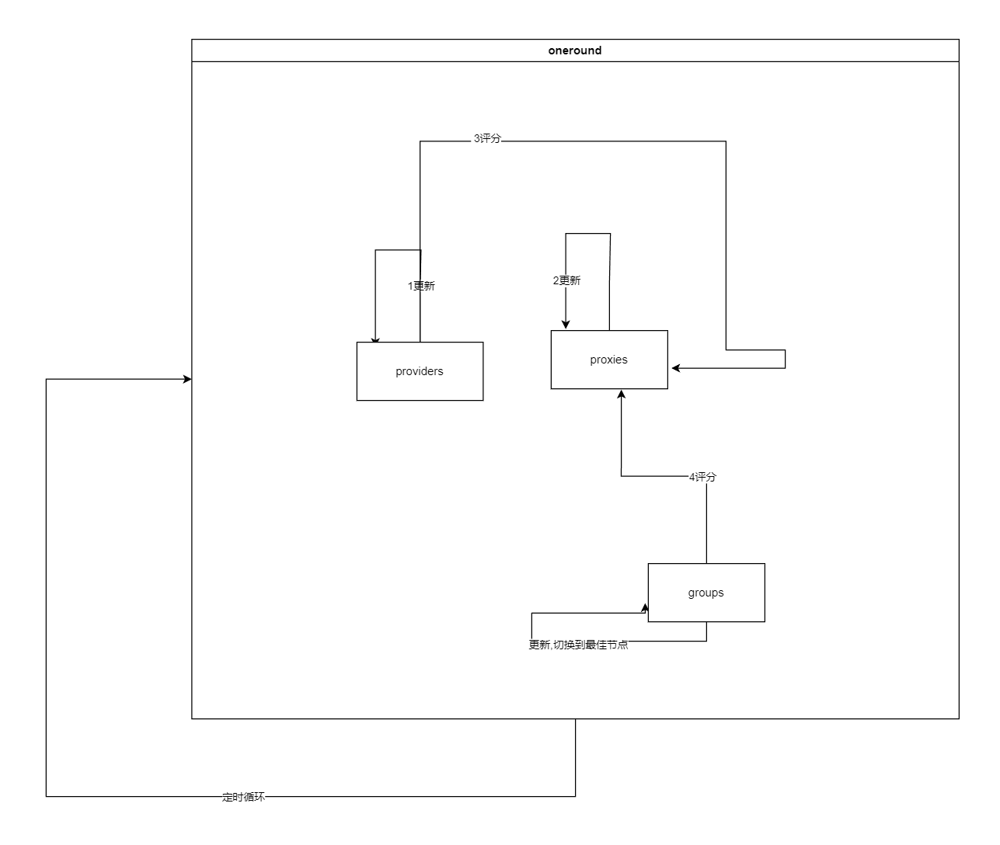
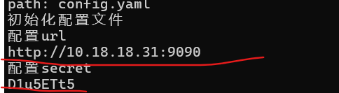

# Casher
<!-- PROJECT LOGO -->
<br />

<p align="center">
  <a href="https://github.com/keai336/casher/">
    
  </a>

  <h3 align="center">casher</h3>
  <p align="center">
    一只全职casher的猫,遵照boss的心意
    <br />
    <a href="https://github.com/keai336/casher"><strong>探索本项目的文档 »</strong></a>
    <br />
    <br />
    <a href="https://github.com/keai336/casher">查看Demo</a>
    ·
    <a href="https://github.com/keai336/casher/issues">报告Bug</a>
    ·
    <a href="https://github.com/keai336/casher/issues">提出新特性</a>
  </p>

</p>
 
## 目录

- [上手指南](#上手指南)
  - [安装步骤](#安装步骤)
- [文件目录说明](#文件目录说明)
- [部署](#部署)
- [使用到的框架](#使用到的框架)
- [版本控制](#版本控制)
- [作者](#作者)
- [鸣谢](#鸣谢)

### 上手指南
1. 你需要的配置文件是有provider,而且组的proxies来自use关键字
2. 原理就是通过api获取provider,通过provider获取proxy.
3. group是对这些proxy的引用.
4. 定时评价,provider对所有proxy测速,然后评分;到组内根据group的偏好进行二次评分,然后切换到最适合的proxy
5. 评价是基于proxy的延迟,provider,还有标签计算的.
6. 组内评价时,会遍历proxy的mark,如果mark在group的grouplabeldic里,获得对应值的加成,大于1的值都是正向加成.如果group的grouplabeldic有流媒体相关的标签,还会检查其连通性,这是单独的评价,通过流通性检查的proxy分数也会有加成
7. 详细看config.yaml里的标注
8. 流程图 
###### **安装步骤**
1. 自己编译或者下载release中的
2. 第一次运行直接运行;后续运行可以指定配置文件路径
- 注意
  - 配置示例
### 文件目录说明
eg:

```
filetree 
<<<<<<< HEAD
│  blacklist
│  cahser_test.go
│  casher.go
│  config.yaml
│  dash
│  dash.exe
│  first_test.go
│  go.mod
│  go.sum
│  logo.png
│  main.go
│  README.md
│  README0.md
│  test.yaml
│  time_test.go
│  示例.png
│
├─config
│      config.go
│      config_test.go
│      test.yaml
│
├─grade
│      funcs.go
│      func_test.go
│      gradegroup.go
│      gradeprovider.go
│      gradeproxy.go
│      lockcheck.go
│      mysql.go
│
├─plus
│      delay.go
│      delay_test.go
│      group.go
│      provider.go
│
└─user
        funcs_test.go
```


### 部署

暂无

### 使用到的框架

- [nkeonkeo/MediaUnlockTest](https://github.com/nkeonkeo/MediaUnlockTest)
- [obgnail/clash-api](https://github.com/obgnail/clash-api)


### 版本控制

该项目使用Git进行版本管理。您可以在repository参看当前可用版本。

### 作者

keai
 

 *您也可以在贡献者名单中参看所有参与该项目的开发者。*


### 鸣谢


- [nkeonkeo/MediaUnlockTest](https://github.com/nkeonkeo/MediaUnlockTest)
- [obgnail/clash-api](https://github.com/obgnail/clash-api)


